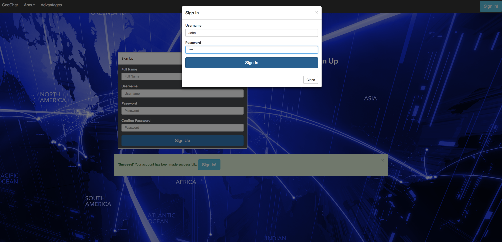
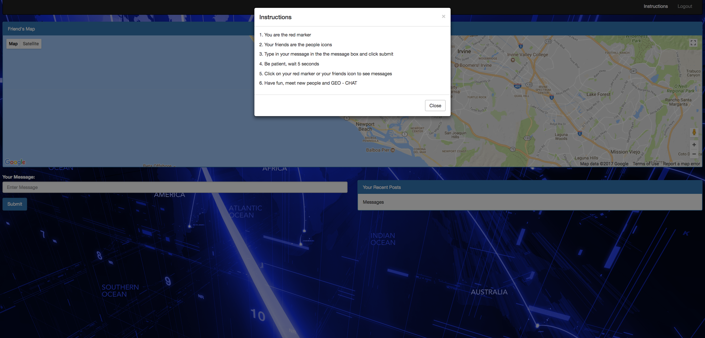

# GeoChat

Welcome to GeoChat! 

This application allows you to dynamically and efficiently chat with other users and see their locations. Simply post a message to show your location and find other users that are around you to chat with them. 

This app will revolutionize the way you message.

No longer will you get lost or lose your friends.
Find and chat with new friends.
Become part of a community and discover new people.

Sign in and out at your convience to simply turn it off when you don't want to chat any longer or share your location.

Technology used:

- HTML, CSS, Bootstrap, Javascript and jQuery
- Node Express Server and MySql database
- Sequelize and implemented user interface with MVC
- Location feature utilizing google maps API
- User authentication and verification for application log in

 

 

 

 